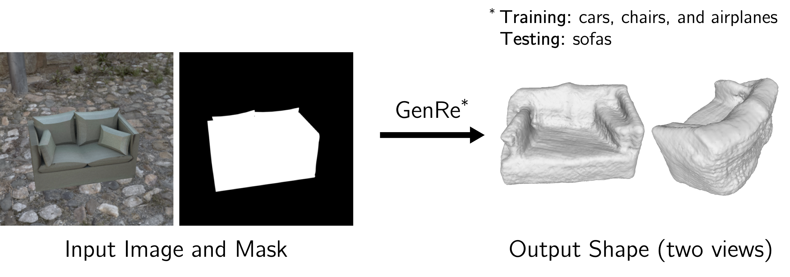
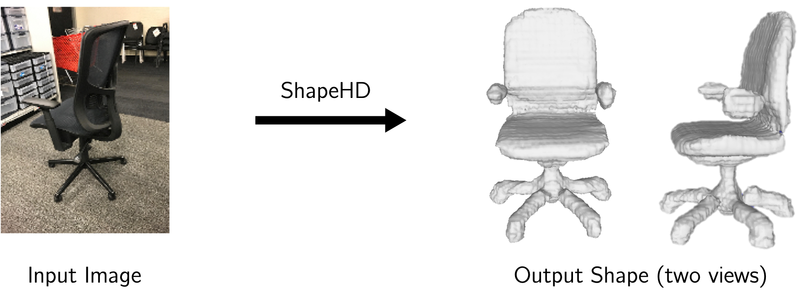

# Generalizable Reconstruction (GenRe) and ShapeHD


## Papers

This is a repo covering the following three papers. If you find the code useful, please cite the paper(s).

1. Generalizable Reconstruction (GenRe)<br/>
**Learning to Reconstruct Shapes from Unseen Classes**<br/>
[Xiuming Zhang](http://people.csail.mit.edu/xiuming/)&ast;, [Zhoutong Zhang](https://ztzhang.info)&ast;, [Chengkai Zhang](https://www.csail.mit.edu/person/chengkai-zhang), [Joshua B. Tenenbaum](http://web.mit.edu/cocosci/josh.html), [William T. Freeman](https://billf.mit.edu/), and [Jiajun Wu](https://jiajunwu.com/)<br/>
*NeurIPS 2018 (Oral)*<br/>
[Paper](http://genre.csail.mit.edu/papers/genre_nips.pdf) &nbsp; | &nbsp; [BibTeX](http://genre.csail.mit.edu/bibtex/genre_nips.bib) &nbsp; | &nbsp; [Project](http://genre.csail.mit.edu/)

	&ast; indicates equal contribution.

1. ShapeHD<br/>
**Learning Shape Priors for Single-View 3D Completion and Reconstruction**<br/>
[Jiajun Wu](https://jiajunwu.com/)&ast;, [Chengkai Zhang](https://www.csail.mit.edu/person/chengkai-zhang)&ast;, [Xiuming Zhang](http://people.csail.mit.edu/xiuming/), [Zhoutong Zhang](https://ztzhang.info), [William T. Freeman](https://billf.mit.edu/), and [Joshua B. Tenenbaum](http://web.mit.edu/cocosci/josh.html)<br/>
*ECCV 2018*<br/>
[Paper](http://shapehd.csail.mit.edu/papers/shapehd_eccv.pdf) &nbsp; | &nbsp; [BibTeX](http://shapehd.csail.mit.edu/bibtex/shapehd_eccv.bib) &nbsp; | &nbsp; [Project](http://shapehd.csail.mit.edu/)

1. MarrNet<br/>
**MarrNet: 3D Shape Reconstruction via 2.5D Sketches**<br/>
[Jiajun Wu](https://jiajunwu.com/)&ast;, [Yifan Wang](https://homes.cs.washington.edu/~yifan1/)&ast;, [Tianfan Xue](https://people.csail.mit.edu/tfxue/), [Xingyuan Sun](http://people.csail.mit.edu/xingyuan/), [William T. Freeman](https://billf.mit.edu/), and [Joshua B. Tenenbaum](http://web.mit.edu/cocosci/josh.html)<br/>
*NeurIPS 2017*<br/>
[Paper](http://marrnet.csail.mit.edu/papers/marrnet_nips.pdf) &nbsp; | &nbsp; [BibTeX](http://marrnet.csail.mit.edu/bibtex/marrnet_nips.bib) &nbsp; | &nbsp; [Project](http://marrnet.csail.mit.edu/)


## Environment Setup

All code was built and tested on Ubuntu 16.04.5 LTS with Python 3.6, PyTorch 0.4.1, and CUDA 9.0. Versions for other packages can be found in `environment.yml`.

1. Clone this repo with
	```
    # cd to the directory you want to work in
	git clone https://github.com/xiumingzhang/GenRe-ShapeHD.git
	cd GenRe-ShapeHD
	```
	The code below assumes you are at the repo root.

1. Create a conda environment named `shaperecon` with necessary dependencies specified in `environment.yml`. In order to make sure trimesh is installed correctly, please run `install_trimesh.sh` after setting up the conda environment.
	```
	conda env create -f environment.yml
	./install_trimesh.sh
	```
	The TensorFlow dependency in `environment.yml` is for using TensorBoard only. Remove it if you do not want to monitor your training with TensorBoard.

1. The instructions below assume you have activated this environment and built the cuda extension with
	```
	source activate shaperecon
	./build_toolbox.sh
	```
Note that due to the deprecation of cffi from pytorch 1.0 and on, this only works for pytorch 0.4.1.


## Downloading Our Trained Models and Training Data

### Models

To download our trained GenRe and ShapeHD models (1 GB in total), run
```
wget http://genre.csail.mit.edu/downloads/genre_shapehd_models.tar -P downloads/models/
tar -xvf downloads/models/genre_shapehd_models.tar -C downloads/models/
```

* GenRe: `depth_pred_with_inpaint.pt` and `full_model.pt`
* ShapeHD: `marrnet1_with_minmax.pt` and `shapehd.pt`

### Data

This repo comes with a few [Pix3D](http://pix3d.csail.mit.edu/) images and [ShapeNet](https://www.shapenet.org/) renderings, located in `downloads/data/test`, for testing purposes.

For training, we make available our RGB and 2.5D sketch renderings, paired with their corresponding 3D shapes, for ShapeNet cars, chairs, and airplanes, with each object captured in 20 random views. Note that this `.tar` is 143 GB.
```
wget http://genre.csail.mit.edu/downloads/shapenet_cars_chairs_planes_20views.tar -P downloads/data/
mkdir downloads/data/shapenet/
tar -xvf downloads/data/shapenet_cars_chairs_planes_20views.tar -C downloads/data/shapenet/
```

**New (Oct. 20, 2019)**

For training, in addition to the renderings already included in the initial release, we now also release the Mitsuba scene `.xml` files used to produce these renderings. [This download link](http://genre.csail.mit.edu/downloads/training_xml.zip) is a `.zip` (394 MB) consisting of the three training classes: cars, chairs, and airplanes. Among other scene parameters, camera poses can now be retrieved from these `.xml` files, which we hope would be useful for tasks like camera/object pose estimation.

For testing, we release the data of the unseen categories shown in Table 1 of the paper. [This download link](http://genre.csail.mit.edu/downloads/shapenet_unseen.tar) is a `.tar` (44 GB) consisting of, for each of the unseen classes, the 500 random shapes we used for testing GenRe. Right now, nine classes are included, as we are tracking down the 10th.


## Testing with Our Models

We provide `.sh` wrappers to perform testing for GenRe, ShapeHD, and MarrNet (without the reprojection consistency part).

### GenRe

See `scripts/test_genre.sh`.

<p align="center">
	
</p>

We updated our entire pipeline to support fully differentiable end-to-end finetuning. In our NeurIPS submission, the projection from depth images to spherical maps was not implemented in a differentiable way. As a result of both the pipeline and PyTorch version upgrades, the model performace is slightly different from what was reported in the original paper.

Below we tabulate the original vs. updated Chamfer distances (CD) across different Pix3D classes. The "Original" row is from Table 2 of the paper.

|          |Chair | Bed | Bookcase  | Desk  | Sofa |  Table  | Wardrobe |
|----------|:----:|:---:|:---:|:---:|:---:|:---:|:---:|
|  **Updated** | .094 | .117  | .104  | .110  |  .086  | .114 | .106 |
| **Original** | .093 | .113  | .101  | .109  |  .083  | .116 | .109 |

### ShapeHD

See `scripts/test_shapehd.sh`.

<p align="center">
	
</p>

After ECCV, we upgraded our entire pipeline and re-trained ShapeHD with this new pipeline. The models released here are newly trained, producing quantative results slightly better than what was reported in the ECCV paper. If you use [the Pix3D repo](https://github.com/xingyuansun/pix3d) to evaluate the model released here, you will get an average CD of 0.122 for the 1,552 untruncated, unoccluded chair images (whose inplane rotation < 5&deg;). The average CD on Pix3D chairs reported in the paper was 0.123.

### MarrNet w/o Reprojection Consistency

See `scripts/test_marrnet.sh`.

The architectures in this implementation of MarrNet are different from those presented in the original NeurIPS 2017 paper. For instance, the reprojection consistency is not implemented here. MarrNet-1 that predicts 2.5D sketches from RGB inputs is now a U-ResNet, different from its original architecture. That said, the idea remains the same: predicting 2.5D sketches as an intermediate step to the final 3D voxel predictions.

If you want to test with the original MarrNet, see [the MarrNet repo](https://github.com/jiajunwu/marrnet) for the pretrained models.


## Training Your Own Models

This repo allows you to train your own models from scratch, possibly with data different from our training data provided above. You can monitor your training with TensorBoard. For that, make sure to include `--tensorboard` while running `train.py`, and then run
```
python -m tensorboard.main --logdir="$logdir"/tensorboard
```
to visualize your losses.

### GenRe

Follow these steps to train the GenRe model.
1. Train the depth estimator with `scripts/train_marrnet1.sh`
1. Train the spherical inpainting network with `scripts/train_inpaint.sh`
1. Train the full model with `scripts/train_full_genre.sh`

### ShapeHD

Follow these steps to train the ShapeHD model.
1. Train the 2.5D sketch estimator with `scripts/train_marrnet1.sh`
1. Train the 2.5D-to-3D network with `scripts/train_marrnet2.sh`
1. Train a 3D-GAN with `scripts/train_wgangp.sh`
1. Finetune the 2.5D-to-3D network with perceptual losses provided by the discriminator of the 3D-GAN, using `scripts/finetune_shapehd.sh`

### MarrNet w/o Reprojection Consistency

Follow these steps to train the MarrNet model, excluding the reprojection consistency.
1. Train the 2.5D sketch estimator with `scripts/train_marrnet1.sh`
1. Train the 2.5D-to-3D network with `scripts/train_marrnet2.sh`
1. Finetune the 2.5D-to-3D network with `scripts/finetune_marrnet.sh`


## Questions

Please open an issue if you encounter any problem. You will likely get a quicker response than via email.


## Changelog

* Dec. 28, 2018: Initial release
* Oct. 20, 2019: Added testing data of the unseen categories, and all `.xml` scene files used to render training data
